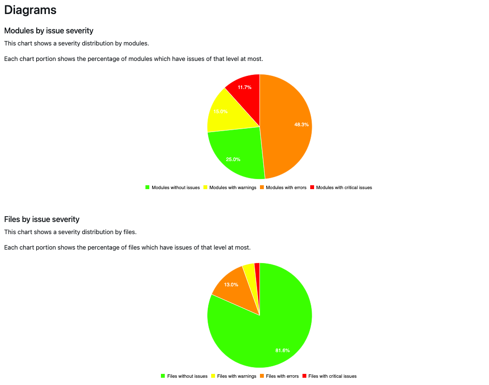

# Rapporten

{{commerce-only}}

Op grond van de analyse [!DNL Upgrade Compatibility Tool] U kunt een rapport exporteren dat een lijst met problemen voor elk bestand bevat waarin de ernst, foutcode en beschrijving van de fout worden aangegeven. De [!DNL Upgrade Compatibility Tool] het rapport wordt in twee verschillende formaten geëxporteerd:

- A [JSON-bestand](reports.md#json-file).
- An [HTML-rapport](reports.md#html-report).

Zie het volgende bevel-lijn interfacevoorbeeld van een rapport:

```terminal
File: /app/code/Custom/CatalogExtension/Controller/Index/Index.php
------------------------------------------------------------------
 * [WARNING][1131] Line 10: Extending from class 'Magento\Framework\App\Action\Action' that is @deprecated on version '2.4.4'
 * [ERROR][1328] Line 10: Implemented interface 'Magento\Framework\App\Action\HttpGetActionInterface' that is non API on version '2.4.4'
```

Controleer de [Verwijzing naar foutbericht](../upgrade-compatibility-tool/error-messages.md) onderwerp voor meer informatie over de verschillende fouten dit rapport kan veroorzaken.

Dit verslag bevat ook een gedetailleerde samenvatting die het volgende laat zien:

- *Huidige versie*: de versie die momenteel is geïnstalleerd.
- *Doelversie*: de versie waarnaar u wilt upgraden.
- *Uitvoeringstijd*: de hoeveelheid tijd die de analyse nodig had om het rapport op te stellen (mm:ss).
- *Modules die update vereisen*: het percentage modules dat compatibiliteitsproblemen bevat en moet worden bijgewerkt.
- *Bestanden die moeten worden bijgewerkt*: het percentage bestanden dat compatibiliteitsproblemen bevat en moet worden bijgewerkt.
- *Totaal aantal kritieke fouten*: het aantal aangetroffen kritieke fouten.
- *Totaal aantal fouten*: het aantal gevonden fouten.
- *Totaal aantal waarschuwingen*: het aantal gevonden waarschuwingen.
- *piekgebruik van geheugen*: de maximale hoeveelheid geheugen [!DNL Upgrade Compatibility Tool] is bereikt tijdens de uitvoering.

Zie het volgende bevel-lijn interfacevoorbeeld:

```terminal
 ----------------------------- ----------------- 
  Current version               2.4.1            
  Target version                2.4.4            
  Execution time                1m:8s            
  Modules that require update   71.67% (43/60)   
  Files that require update     18.05% (96/532)  
  Total critical issues         24               
  Total errors                  159              
  Total warnings                53               
  Memory peak usage             902.00 MB        
 ----------------------------- ----------------- 
```

## JSON-bestand

U kunt de uitvoer van het JSON-bestand ophalen terwijl u het dialoogvenster [!DNL Upgrade Compatibility Tool] op een opdrachtregelinterface. De `JSON` het bestand bevat exact dezelfde gegevens als worden weergegeven op het tabblad [!DNL Upgrade Compatibility Tool] uitvoer:

- Een lijst met geïdentificeerde problemen.
- Een samenvatting van de analyse.

Voor elke ondervonden kwestie, verstrekt het rapport gedetailleerde informatie zoals de ernst en de beschrijving van het probleem.

Deze exporteren `JSON` bestand in een andere uitvoermap:

```bash
bin/uct upgrade:check <dir> --json-output-path[=JSON-OUTPUT-PATH]
```

Waar de argumenten als volgt zijn:

- `<dir>`: Adobe Commerce-installatiemap.
- `[=JSON-OUTPUT-PATH]`: Padmap om het pad te exporteren `JSON` uitvoerbestand.

>[!NOTE]
>
> Het standaardpad voor de uitvoermap is `var/output/[TIME]-results.json`.

## HTML-rapport

U kunt het rapport van de HTML krijgen terwijl het in werking stellen van het hulpmiddel op een bevel-lijn interface of door [!DNL Site-Wide Analysis Tool]. Het verslag-HTML bevat ook:

- Een lijst met geïdentificeerde problemen.
- Een samenvatting van de analyse.


U kunt gemakkelijk door de geïdentificeerde kwesties navigeren tijdens [!DNL Upgrade Compatibility Tool] analyse.

U kunt de problemen die in het rapport worden weergegeven, filteren op basis van het minimale emissieniveau (de standaardwaarde is `WARNING`).

In de rechterbovenhoek bevindt zich een vervolgkeuzelijst waarin u een ander niveau kunt selecteren. De lijst met geïdentificeerde problemen wordt dienovereenkomstig gefilterd.


>[!NOTE]
>
> De kwesties met lager uitgifteniveau worden geschrapt maar u krijgt een bericht zodat bent u altijd op de hoogte van de geïdentificeerde kwesties per module.

Het rapport HTML bevat ook vier verschillende grafieken:

- **Modules naar uitgifteernst**: Toont strengheidsverdeling door modules.
- **Bestanden met de ernst van de uitgave**: Hiermee geeft u de verdeling van de ernst per bestand weer.
- **Modules geordend op totaal aantal emissies**: Toont de 10 meest gecompromitteerde modules rekening houdend met waarschuwingen, fouten, en kritieke fouten.
- **Modules met relatieve grootten en problemen**: Hoe meer bestanden een module bevat, hoe groter de cirkel. Hoe meer problemen een module heeft, hoe meer rood de cirkel wordt weergegeven.

Deze grafieken staan u toe om de modules te identificeren die het meest gecompromitteerd zijn en degenen die meer werk vereisen om een verbetering uit te voeren.



De diagrammen van het HTML-rapport worden eveneens dienovereenkomstig bijgewerkt, met uitzondering van de `Modules with relative sizes and issues`, die met de `min-issue-level` die oorspronkelijk was opgezet.

Als u verschillende resultaten wilt zien voor de `Modules with relative sizes and issues` diagram, moet u het bevel opnieuw in werking stellen die een andere waarde voor het verstrekken `--min-issue-level` optie.


Dit HTML-rapport exporteren naar een andere uitvoermap:

```bash
bin/uct upgrade:check <dir> --html-output-path[=HTML-OUTPUT-PATH]
```

Waar de argumenten als volgt zijn:

- `<dir>`: Adobe Commerce-installatiemap.
- `[=HTML-OUTPUT-PATH]`: Padmap om het pad te exporteren `.html` uitvoerbestand.

>[!NOTE]
>
> Het standaardpad voor de uitvoermap is `var/output/[TIME]-results.html`.
